# Coffeehub

<a href="https://coffee-hub-64aa59561310.herokuapp.com/" target="_blank">Live project can be viewed here</a>

Welcome to Coffee Hub, your one-stop platform for premium coffee and related merchandise. This e-commerce application showcases advanced functionalities, delivering a seamless and enjoyable shopping experience.

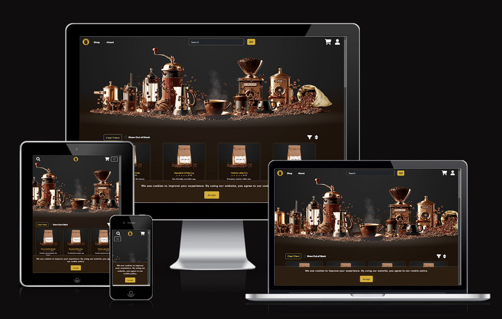

<div align="center">


</div>

---
# Table of Contents


---
# Introduction

Coffee Hub is a luxurious e-commerce platform dedicated to coffee enthusiasts, offering a curated selection of premium coffee beans, brewing equipment, and accessories. The platform is designed to provide a seamless shopping experience, integrating a robust payment gateway, real-time inventory updates, and personalized recommendations based on user preferences. Coffee Hub is the perfect destination for anyone looking to elevate their coffee experience.

## Objective
Our objective is to provide a sophisticated yet user-friendly online store for coffee lovers of all levels. By focusing on high-quality products, convenient ordering, and reliable deliveries, we aim to become the go-to platform for those seeking an elevated coffee experience.

## Audience
Our primary audience consists of discerning coffee drinkers who value premium beans, specialty brewing methods, and top-tier equipment. We also cater to newcomers interested in exploring the world of coffee, ensuring a welcoming environment for all.

## Solution
Coffee Hub centralizes everything a coffee enthusiast needs—premium products, easy checkout, and personalized suggestions—into one platform. We leverage modern web technologies to ensure consistent performance, user security, and smooth navigation across all devices.

## Scope
The scope of Coffee Hub covers product discovery, secure transactions, order management, and user-generated reviews that admins can moderate. By keeping the user interface intuitive and visually appealing, we streamline the shopping journey from browsing to checkout.

---
# Business and Marketing plan

## User Experience
We prioritize an elegant, intuitive user interface featuring dark-mode design with warm accents that evoke the ambiance of a coffee shop. Users can effortlessly browse categories, use search filters, add products to their carts, securely pay for their orders and manage the account. All prices include taxes and delivery fees already, the announced pricing is always the final price being paid.

## Market
Coffee Hub operates within the booming specialty coffee market, targeting consumers who appreciate ethically sourced beans and premium brewing gear. We distinguish ourselves by offering a curated catalog, focusing on quality and variety rather than mass-market products.

## Revenue model
Our platform follows a standard e-commerce approach, generating profit through margins on every product sold — no middle-person or commission-based fees. This model ensures straightforward pricing for customers and a sustainable revenue stream for Coffee Hub.

## Marketing
Our marketing strategy combines targeted social media campaigns, search engine optimization, and collaborations with influencers in the coffee community. We share rich, visually appealing content to highlight our products’ unique origins and flavor profiles, while email newsletters keep loyal customers informed about new arrivals and promotions.

## KPIs
- **Sales Volume**: Measure growth in weekly and monthly sales.
- **Conversion Rate**: Track how many site visitors become paying customers.
- **Average Order Value (AOV)**: Monitor how much each customer spends per order.
- **Customer Retention**: Evaluate returning customer rates and loyalty program participation.
- **Review Engagement**: Assess how often customers share feedback and star ratings.

## Risks
- **Supplier Reliability**: Inconsistent supply or quality issues could damage our reputation.
- **Market Competition**: Competing e-commerce sites and coffee subscriptions may attract similar audiences.
- **Operational Scalability**: Rapid growth could strain fulfillment processes or customer support.
- **Regulatory Changes**: Shifts in e-commerce or import/export regulations could impact logistics.

## Growth Opportunities

- **Expanded Catalog**: Introduce more exclusive or rare coffee varieties, roasts, and coffee accessories.
- **Partnerships**: Collaborate with local producers and specialty roasters, featuring unique blends that encourage brand loyalty.

---
# Agile Methodology and Planning

## Epics

### Epic 1: Project Setup and Initial Configuration

In this epic, the primary objective is to fully establish the Django front-end website, with comprehensive content management through the admin dashboard. Key deliverables include the creation of branding elements and the development of a functional, polished landing page that reflects the final version of the site. Additionally, this epic covers the initial setup, including the installation of essential Python modules and the configuration of testing parameters to ensure the front-end website operates smoothly.

<details><summary><b>User Stories</b></summary>

- [STORY 1.1 - As a developer, I want to set up the Django environment and establish the initial project structure so that the project has a solid foundation for further development.](https://github.com/catapam/coffe-hub/issues/7)
- [STORY 1.2 - As a developer, I want to select and configure a SQL database (MySQL or PostgreSQL) so that the project has a reliable and scalable data storage solution.](https://github.com/catapam/coffe-hub/issues/8)
- [STORY 1.3 - As a developer, I want to deploy the Django project to Heroku so that the application is accessible online and ready for further development.](https://github.com/catapam/coffe-hub/issues/9)
- [STORY 1.4 - As a developer, I want to create and integrate basic front-end templates so that the application has a consistent design and user experience.](https://github.com/catapam/coffe-hub/issues/10)
- [STORY 1.5 - As a developer, I want to establish copyright, branding, and basic project documentation so that the project is legally compliant and easy to understand.](https://github.com/catapam/coffe-hub/issues/11)
- [STORY 1.6 - As a developer, I want to implement automated testing using Python so that the project's codebase remains stable and errors are caught early in development.](https://github.com/catapam/coffe-hub/issues/12)

</details>

### Epic 2: User Authentication and Authorization

This epic focuses on implementing a robust user authentication and authorization system. The goal is to enable secure user registration, login, and access management. Core tasks include integrating Django’s authentication framework, setting up user roles and permissions, and ensuring data security through encryption. By the end of this epic, the website will support secure user interactions, with role-based access control fully implemented.

<details><summary><b>User Stories</b></summary>

- [STORY 2.1 - As a user, I want to register an account so that I can access the system.](https://github.com/catapam/coffe-hub/issues/13)
- [STORY 2.2 - As a user, I want to log in to my account so that I can access my portfolio.](https://github.com/catapam/coffe-hub/issues/14)
- [STORY 2.3 - As a user, I want to reset my password if I forget it so that I can regain access to my account.](https://github.com/catapam/coffe-hub/issues/15)
- [STORY 2.4 - As an admin, I want to assign roles to users so that I can control access to different functionalities.](https://github.com/catapam/coffe-hub/issues/16)

</details>

### Epic 3: Store

This epic is dedicated to implementing the product catalog, search, and detailed views for items in the store. It ensures users can browse, filter, and find products with ease. Key features include a responsive product display, search functionality, and categorization to enhance the shopping experience.

<details><summary><b>User Stories</b></summary>

- [STORY 3.1 - As a customer, I want to browse a catalog of products with filtering options so that I can easily find products based on my preferences.](https://github.com/catapam/coffe-hub/issues/17)
- [STORY 3.2 - As a customer, I want to search for products by name or keywords so that I can quickly find what I’m looking for.](https://github.com/catapam/coffe-hub/issues/18)
- [STORY 3.3 - As a customer, I want to view detailed information about a product so that I can make an informed purchasing decision.](https://github.com/catapam/coffe-hub/issues/19)
- [STORY 3.4 - As an admin, I want to categorize products so that customers can easily browse by product type.](https://github.com/catapam/coffe-hub/issues/20)
- [STORY 3.5 - As an admin, I want to manage product inventory levels so that customers can see product availability before making a purchase.](https://github.com/catapam/coffe-hub/issues/21)
- [STORY 3.6 - As a customer, I want to leave reviews and ratings for products so that I can share my experience and help others decide.](https://github.com/catapam/coffe-hub/issues/22)
- [STORY 3.7 - As a customer, I want to add, remove, and edit products in my cart, so I can easily manage my shopping list before checkout.](https://github.com/catapam/coffe-hub/issues/229)

</details>

### Epic 4: Payment Gateway

This epic focuses on integrating a secure and efficient payment system into the website. Key deliverables include the implementation of Stripe for payment processing, a user-friendly checkout process, and comprehensive payment feedback. By the end of this epic, users will be able to complete transactions smoothly, with secure data handling and clear notifications.

<details><summary><b>User Stories</b></summary>

- [STORY 4.1 - As a developer, I want to integrate the Stripe payment gateway so that users can make secure payments for their purchases.](https://github.com/catapam/coffe-hub/issues/23)
- [STORY 4.2 - As a user, I want to go through a structured checkout process so that I can complete my purchases smoothly.](https://github.com/catapam/coffe-hub/issues/24)
- [STORY 4.3 - As a user, I want to receive feedback after making a payment so that I know if my purchase was successful or if there was an issue.](https://github.com/catapam/coffe-hub/issues/25)
- [STORY 4.4 - As a developer, I want to log transaction details so that users can access their payment history and admins can track order details.](https://github.com/catapam/coffe-hub/issues/26)
- [STORY 4.5 - As a developer, I want to validate orders before processing payment so that I can ensure correct pricing and inventory levels.](https://github.com/catapam/coffe-hub/issues/27)
- [STORY 4.6 - As an admin, I want to manage refunds and payment reversals so that customers can be refunded for eligible purchases.](https://github.com/catapam/coffe-hub/issues/28)

</details>

### Epic 5: Account Management

This epic focuses on creating a comprehensive user account management system. Key functionalities include managing user profiles, changing passwords, viewing order history, and managing addresses. Additionally, account deactivation and reactivation processes will be implemented, ensuring users have full control over their accounts.

<details><summary><b>User Stories</b></summary>

- [STORY 5.1 - As a user, I want to be able to view and update my profile information so that my account details are accurate and up to date.](https://github.com/catapam/coffe-hub/issues/29)
- [STORY 5.2 - As a user, I want to be able to change my password securely so that my account remains protected.](https://github.com/catapam/coffe-hub/issues/30)
- [STORY 5.3 - As a user, I want to view my order history so that I can keep track of past purchases and their details.](https://github.com/catapam/coffe-hub/issues/31)
- [STORY 5.4 - As a user, I want to manage multiple shipping addresses so that I can select the correct one during checkout.](https://github.com/catapam/coffe-hub/issues/32)
- [STORY 5.5 - As a user, I want the option to deactivate my account so that I can manage my privacy and control my account’s availability.](https://github.com/catapam/coffe-hub/issues/33)

</details>

### Epic 6: SEO and Marketing

This epic aims to optimize the platform for search engines and enhance its online presence through marketing strategies. The focus includes implementing SEO best practices, integrating social sharing features, and setting up analytics to track user behavior. These efforts ensure the site is discoverable and aligned with marketing goals.

<details><summary><b>User Stories</b></summary>

- [STORY 6.1 - As a developer, I want to create SEO-friendly URLs and page titles so that the site ranks better in search engine results.](https://github.com/catapam/coffe-hub/issues/34)
- [STORY 6.2 - As a developer, I want to add meta descriptions and keywords to key pages so that search engines better understand the content.](https://github.com/catapam/coffe-hub/issues/35)
- [STORY 6.3 - As a developer, I want to create a sitemap.xml file so that search engines can crawl the site more effectively.](https://github.com/catapam/coffe-hub/issues/36)
- [STORY 6.4 - As a developer, I want to add a robots.txt file to control which parts of the site search engines can crawl, so that unwanted content is not indexed.](https://github.com/catapam/coffe-hub/issues/37)
- [STORY 6.5 - As a user, I want to easily share content from the site on social media so that I can spread awareness of the products and engage with others.](https://github.com/catapam/coffe-hub/issues/38)
- [STORY 6.6 - As a site owner, I want to monitor site traffic with Google Analytics so that I can understand user behavior and improve the site based on data insights.](https://github.com/catapam/coffe-hub/issues/39)
- [STORY 6.7 - As a site owner, I want to integrate a newsletter signup form so that I can build a mailing list and engage users with updates and promotions.](https://github.com/catapam/coffe-hub/issues/221)

</details>

## MoSCoW Methodology

All the six epics and their stories are essential for the project delivery, providing all necessary features and expected standards. Therefore, most of these tasks are classified as 'Must Have' or 'Should Have.'

User stories are broken down into tasks, where each task is categorized as 'Must Have,' 'Should Have,' 'Could Have,' or 'Won’t Have.' Each task is also assigned a story point weight of 1, 2, or 4, reflecting the effort required to complete it.

The story point weight and MoSCoW priority of each task for the three sprints (Epics 1, 2, and 3) were carefully planned to allow flexibility in execution. 'Must Haves' do not exceed 60% of the sprint's total story points. 

For documenting and visualization, the sprints were closed with undone tasks/stories, those are all non-'Must have' and would be moved to a future sprint. They were all place in backlog for now but kept inside the sprint for documentation purposes. 

The details for each sprint are provided below:

### Sprint/Epic 1

**Story Point / MoSCoW** | **Must Have** | **Should Have** | **Could Have**
:-----:|:-----:|:-----:|:-----:
**1** | 10 | 0 | 0 |
**2** | 10 | 4 | 0 |
**4** | 1 | 2 | 3 |
**Total** | 34 | 16 | 12 |

- Total story points: 62
- Total 'Must Have': 34
- Must Have proportion: 54.83%

### Sprint/Epic 2

**Story Point / MoSCoW** | **Must Have** | **Should Have** | **Could Have**
:-----:|:-----:|:-----:|:-----:
**1** | 4 | 3 | 0 |
**2** | 8 | 5 | 10 |
**4** | 0 | 0 | 5 |
**Total** | 20 | 13 | 40 |

- Total story points: 73
- Total 'Must Have': 20
- Must Have proportion: 27.40%

### Sprint/Epic 3

**Story Point / MoSCoW** | **Must Have** | **Should Have** | **Could Have**
:-----:|:-----:|:-----:|:-----:
**1** | 0 | 0 | 4 |
**2** | 10 | 5 | 4 |
**4** | 10 | 3 | 3 |
**Total** | 60 | 22 | 24 |

- Total story points: 106
- Total 'Must Have': 60
- Must Have proportion: 56.60%

### Sprint/Epic 4

**Story Point / MoSCoW** | **Must Have** | **Should Have** | **Could Have**
:-----:|:-----:|:-----:|:-----:
**1** | 0 | 2 | 3 |
**2** | 0 | 10 | 1 |
**4** | 12 | 2 | 0 |
**Total** | 48 | 30 | 5 |

- Total story points: 83
- Total 'Must Have': 48
- Must Have proportion: 57.83%

### Sprint/Epic 5

**Story Point / MoSCoW** | **Must Have** | **Should Have** | **Could Have**
:-----:|:-----:|:-----:|:-----:
**1** | 0 | 0 | 5 |
**2** | 2 | 7 | 1 |
**4** | 8 | 2 | 0 |
**Total** | 36 | 22 | 7 |

- Total story points: 65
- Total 'Must Have': 36
- Must Have proportion: 55.38%

### Sprint/Epic 6

**Story Point / MoSCoW** | **Must Have** | **Should Have** | **Could Have**
:-----:|:-----:|:-----:|:-----:
**1** | 0 | 0 | 7 |
**2** | 1 | 14 | 0 |
**4** | 12 | 0 | 1 |
**Total** | 50 | 28 | 11 |

- Total story points: 89
- Total 'Must Have': 50
- Must Have proportion: 56.18%

## Sprint Length

Based on the total story points, each sprint was assigned 1 week length.

## Reviews

Tasks and tickets were reviewed every 3 work days. New tickets, such as bug reports, may have been incorporated into the planning, which sometimes resulted in the removal of tasks from sprints or adjustments to their MoSCoW priorities.

---
# Design

Coffee Hub's design combines elegance with functionality, offering users a visually striking yet highly intuitive experience. The platform leverages a luxurious dark-mode theme with warm, coffee-inspired hues, accented by gold and white details, to create a sophisticated ambiance. This design reflects the essence of premium coffee culture while ensuring usability and accessibility.

Key design principles include:

* **User-Centric Design**: The platform is crafted to provide a seamless user experience, with intuitive navigation, clear categorization of products, and a streamlined checkout process.
* **Responsive Design**: Coffee Hub is fully responsive, delivering a consistent and polished experience across all devices, whether desktop, tablet, or mobile.
* **Visual Elegance**: Rich gradients, subtle lighting effects, and high-quality imagery highlight the premium nature of the products.
* **Accessibility**: The design adheres to accessibility standards, ensuring all users can navigate and interact with the platform effortlessly.
* **Security**: Robust security measures, including secure authentication and encrypted transactions, are integrated to protect user data and payment information.

## Color scheme

* Used <a href="https://coolors.co/" target="_blank">Coolors</a> to create the palette:

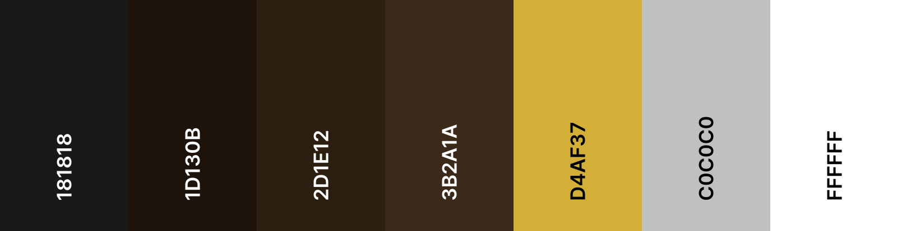

## Typography

* The fonts were choosen on <a href="https://fonts.google.com/" target="_blank">Google fonts</a>, thinking of keeping the same sentiment as the colors passed.
* Primary font family for body text: **Nunito**
* Font family for headings: **Lato**

## Wireframes

* Wireframes were created in Balsamiq during the branding and theme planning, it can be checked here:

<details><summary><b>Home</b></summary>

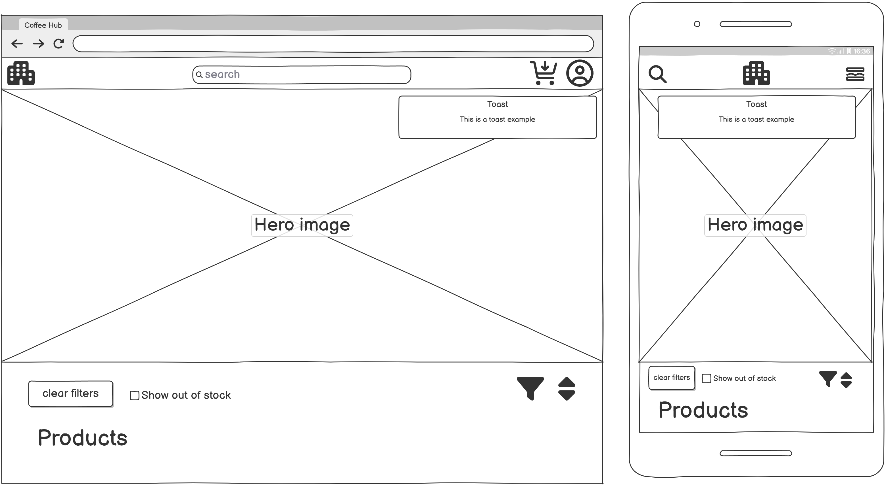

</details>

<details><summary><b>Help</b></summary>

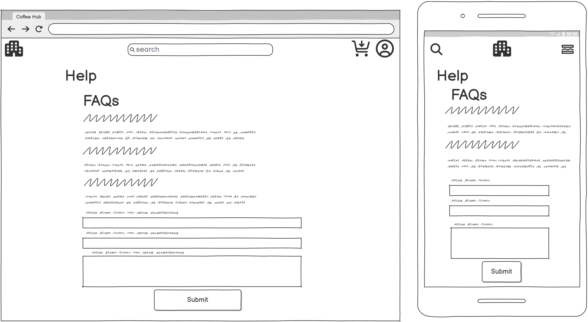

</details>

<details><summary><b>About</b></summary>

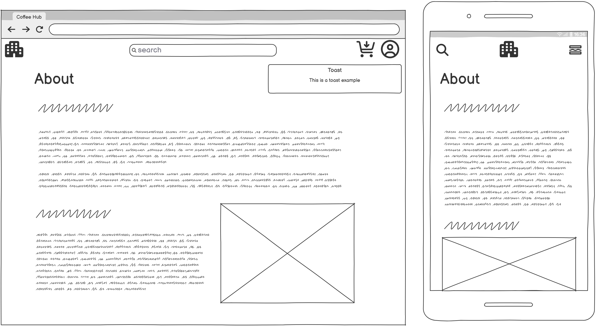

</details>

<details><summary><b>Product List</b></summary>

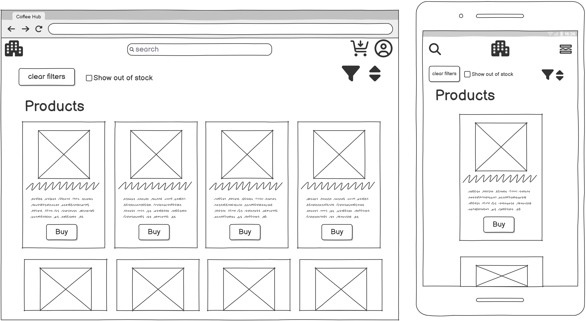

</details>

<details><summary><b>Product Details</b></summary>

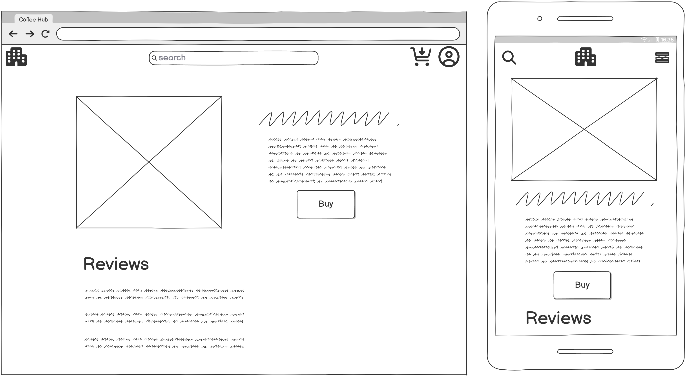

</details>

<details><summary><b>Cart</b></summary>

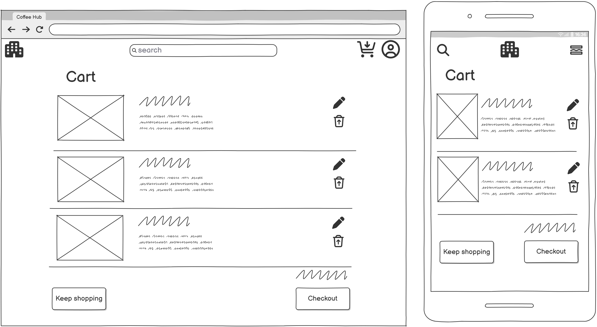

</details>

<details><summary><b>Checkout</b></summary>

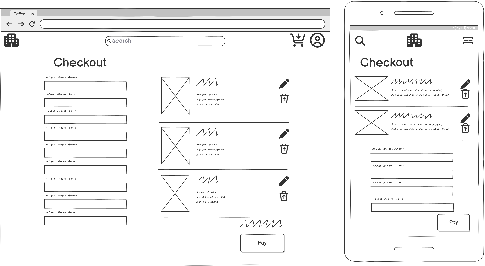

</details>

<details><summary><b>User Portal - Profile</b></summary>

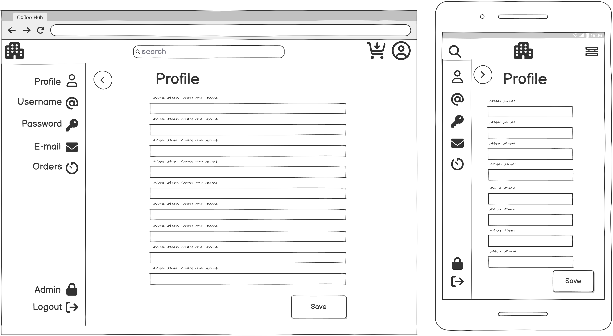

</details>

<details><summary><b>User Portal - Order list</b></summary>

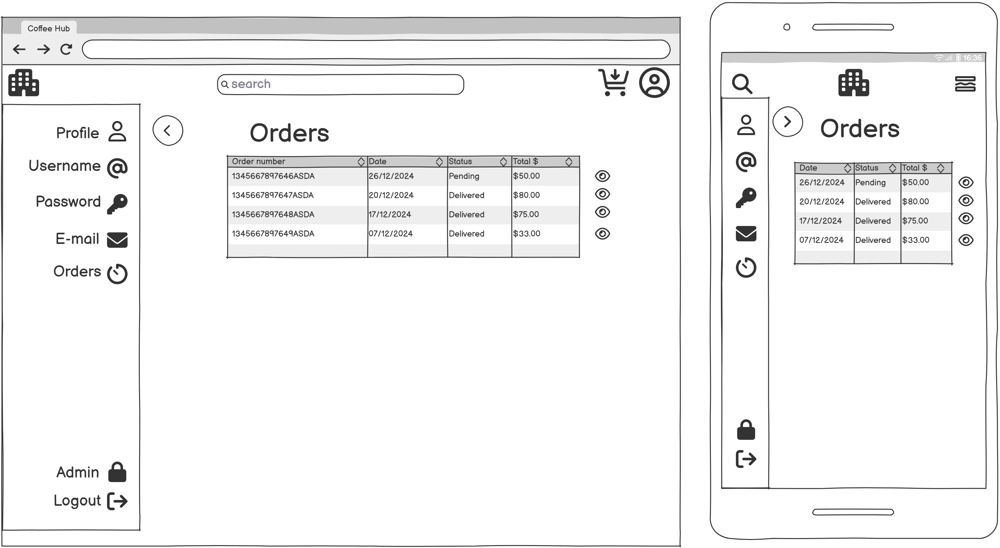

</details>

<details><summary><b>User Portal - Order details</b></summary>

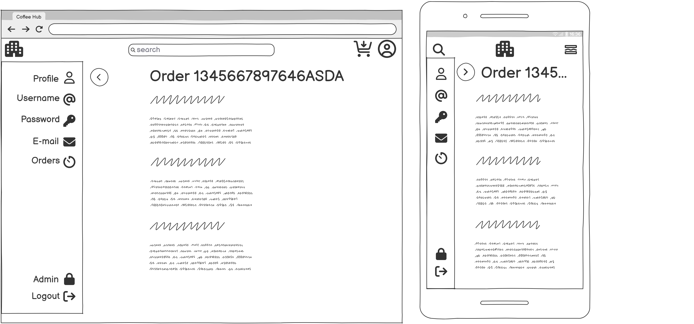

</details>

## Data structure

* Data structure was created using <a href="https://dbeaver.io/" target="_blank">DBeaver</a>:

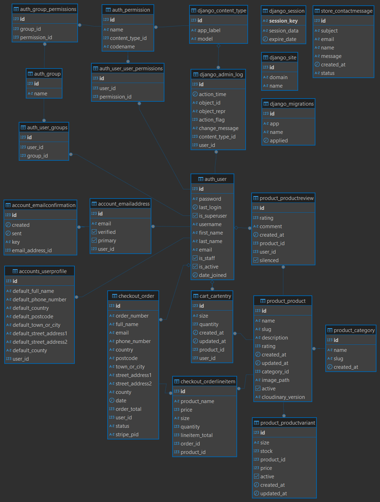

* **Models customization**: All models were somehow customized for the specific needs of this project. Example: Products work in parallel with productVariants, where the sizes, stock and price are dealt with; product reviews; cart entries being saved to the user's account, and even contact form submissions being linked to the user's email address.

* **Frontend CRUD functionalities**: Full CRUD functionality has been added to Cart management, where users can add products to the cart, view, edit and remove from their database cart if they are logged to their account.

* **Soft CRUD for Staff**: Staff and Admins can view, add, and edit products, sizes and categories from the frontend tools. Deactivating products and sizes is available from the product details view when logged either as admin or staff too. Deleting was intetionally restricted to Admins only and can exclusively be done from the custom admin panel.

* **Staff permissions**: Most of deleting permissions are only available to Admins and from Admin panel only. Staff do have access to the admin panel, but view only, with some rare exceptions where they have edit permissions too. That was also built-in as a feature since the beginning of project planning.

---
# Features

## Existing Features and How to Use

Check this video for a full overview of all features:
[](https://www.youtube.com/watch?v=OmTn5QGvCFA)

### General Features

- **Dark Mode**  
  The site is built entirely in dark mode, providing an elevated user experience, enhanced visual comfort, and a cohesive branding theme.

- **Accessibility**  
  Accessibility was a core consideration during development. The platform is inclusive, ensuring all users can navigate and interact with ease.

- **Device Optimization**  
  The platform delivers a rich and seamless experience across all devices, adapting to various screen sizes and input methods (touch, keyboard, mouse, console controllers, etc.). The interface dynamically adjusts to provide an optimized experience based on the device used.

- **Messaging System**  
  A sophisticated toast message system provides real-time feedback for user actions. Toast messages inform users of errors, warnings, successes, and next steps (if applicable), beginning with a warm welcome upon login.

- **Third-Party Cookies Consent**  
  Users are prompted to accept third-party cookies (essential for image rendering) upon their first visit. Acceptance is required to enable core site functionality. The cookies being used do not collect any type of data, the feature is in place as and implementation showcase, where the act of not consenting will make images not load due to the missing cookies.

- **Privacy Policy**  
  The privacy policy is readily accessible via the footer, ensuring transparency and compliance.

- **Footer Elements**  
  The footer includes social media links, shortcuts to key internal pages, a brief description of Coffee Hub, and a newsletter subscription form.

- **Custom Error Pages (401 and 404)**  
  Custom error pages enhance the user experience when encountering restricted content (401) or invalid paths (404). Unauthenticated users attempting to access protected pages are redirected to the login page with a clear toast notification.

- **Help Center**  
  The help page provides an FAQ section and a user-friendly form for submitting contact requests, available to all visitors.

- **About Page**  
  A dedicated about page introduces users to Coffee Hub's mission, values, and objectives.

- **Form Data Validation**  
  All forms feature robust data validation to prevent invalid submissions, offering clear error messages for necessary corrections.

### Products

- **Filtering and Sorting Products**  
  Users, staff, and admins can filter products by price, name, average rating, stock status, and category using intuitive UI elements.

- **Search Functionality**  
  A smart search bar scans product names and descriptions to match user queries, enhancing site navigability.

- **Out-of-Stock Indicators**  
  Products or sizes that are unavailable are clearly marked as "Out of Stock." Sizes with no stock appear grayed out in dropdown selectors. Users can toggle the option to display out-of-stock items via the filtering menu.

- **Product Details Page**  
  Each product has a dedicated page featuring detailed information, user ratings, and reviews. The page dynamically updates based on size selection, improving navigation and usability.

- **Size and Quantity Selectors**  
  Size and quantity selectors ensure smooth interaction without page reloads. Quantity selection respects available stock, and any adjustments due to stock changes are communicated via toast messages.

- **Rating and Reviews**  
  Users can rate products using an interactive coffee bean-themed selector. Ratings glow dynamically based on user interaction, and comments are optional. Reviews are filterable by rating scores, with visible counts for each category.

- **Product Cards**  
  Product cards on the list view feature clickable actions for "Buy" (end users) or "Edit" (staff/admins) and a link to the product details page.

- **AJAX requests on product editting**
  As a showcase of technologies being used, for the Edit and Create Product features, the Post requests are processed as AJAX requests to the backend, working similarly to a custom API gateway. The JSON responses are then processed in JS in order to provide users with error handling messages.

### Cart

- **Session and Persistent Carts**  
  Non-logged users utilize session-based carts, while logged-in users' carts are stored in the database, enabling continuity across sessions.

- **Cart Management**  
  The cart interface supports full CRUD functionality, displaying product details, images, sizes, quantities, unit prices, subtotals, and totals. Users can edit quantities, delete items, or proceed to checkout with ease.

### Account Management

- **User Portal**  
  A comprehensive profile management system allows users to navigate and update their accounts through a unified side menu.

- **Login and Registration**  
  Login includes email verification and password reset functionality, while registration ensures data validation and supports strong password enforcement.

- **Email and Password Management**  
  Users can manage multiple email addresses, verify their primary email, and update passwords securely from the User Portal.

- **Admin/Staff Custom Login and Permissions**  
  Admins and staff have customized login workflows and permission levels tailored to their roles, ensuring secure access to administrative features.

### End-User Features

- **Checkout Process**  
  Logged-in users enjoy a streamlined checkout experience with autofilled account details, editable forms, and secure payment options via Stripe.

- **Order History**  
  Users can view and manage their past orders from the User Portal, with detailed breakdowns of individual purchases.

- **Profile and Address Management**  
  Users can update their personal and address information directly from the User Portal.

### Staff and Admin Features

- **Product Management**  
  Staff and admins can create, edit, deactivate, or reactivate products and sizes. Features include stock and price adjustments, category management, and image uploads.

- **Review Moderation**  
  Staff and admins can silence reviews while retaining their impact on rating calculations, ensuring respectful and constructive feedback is displayed.

- **Custom Admin Panel**  
  Admins have access to a fully branded panel with intuitive navigation, enabling efficient management of users, products, and orders.

- **Permissions and Access**  
  Staff and admin permissions are carefully segmented to ensure secure and appropriate access to features. Staff users have restricted access compared to admins.

- **Stripe link from order**
  When checking the order view from admin/intraney panel, users can click on the payment ID and get redirected directly to the payment page on Stripe, access to Stripe dashboard is needed to continue from there, but the navigation is facilitated with the direct link.

### Developer/Tester Features

- **Cookie Consent Reset**  
  A reset path is available to facilitate testing of cookie consent functionality, accessible to all user levels.

### SEO and marketing features

- **Sitemap.xml**  
  The sitemap provides a structured list of pages accessible to search engines, enhancing their ability to index your site efficiently. It works side-by-side with the `robots.txt` file to fine-tune crawler access. This was set up to be served as a static file.

- **Robots.txt**  
  The `robots.txt` file links to the sitemap and restricts crawlers from accessing certain pages or sections, ensuring an optimized and secure crawling process. Disallowing search queries for example to avoid over-crawling. It's worth keeping in mind this setting is a soft block, the crawlers can choose to follow it or not. This was set up to be served as a static file.

- **Unique and dynamic page titles**  
  By leveraging Django's block elements, each page dynamically updates its title to reflect its content, improving SEO visibility and enhancing the user experience.

- **Unique and dynamic page meta tags**  
  The `base.html` template integrates dynamic context with default fallback values. Views supply context to replace defaults where applicable, enabling a more interactive and tailored SEO strategy across various page types, including product detail pages, About, and Help sections.

- **Facebook business page**
Leverage one of the biggest social medias to deliver content to targetted users using highly engaging visuals through a platform already familiar to most users.

  <details><summary><b>Demo</b></summary>

  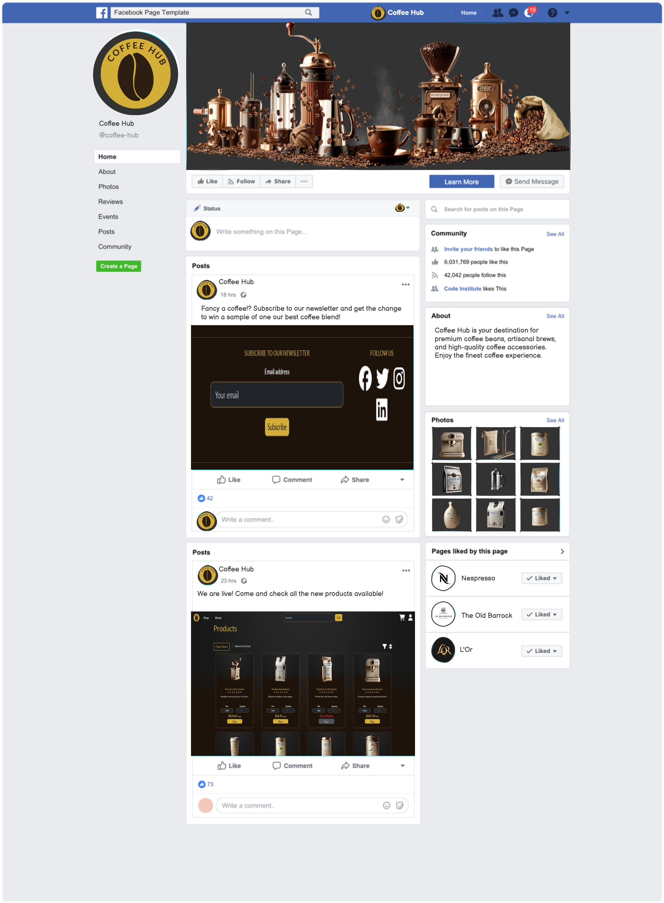

  </details>

- **Newsletter email subscription**
The footer integrates a Mailchimp newsletter signup section, making it easy for visitors to stay informed about the latest news and offers. This feature enhances user engagement by keeping them connected with the brand. The subscription was intentionally set for a 2 step confirmation via email, so the setup can be checked as valid in MailChimp. Due to the account with Mailchimp being a free setup, the links to redirect to the site and list name on the REacptcha page cannot be editted, those only serve the purpose of confirming the functionality of the API setup with Mailchimp.

  <details><summary><b>Demo</b></summary>

  

  </details>

## Future Features

Coffee Hub is dedicated to enhancing the platform with features that improve usability, streamline operations, and foster customer satisfaction. Upcoming features include:

- **Personalized Product Recommendations**  
  New users will see curated suggestions based on popular products, while returning customers will receive tailored recommendations driven by their purchase history and preferences.

- **Integrated Chat Support**  
  A live chat system will provide instant support, the preferred communication method for most users, enhancing the overall customer experience.

- **AI-Powered Assistance**  
  Chat support will include AI-driven tools to triage customer queries and deliver relevant, accurate responses efficiently.

- **Comprehensive Ticketing System**  
  A centralized tool will allow staff to manage customer communications and enable users to track the status of their inquiries, fostering transparency and trust.

- **Expanded Payment Methods and Models**  
  Additional payment options, including PayPal, cryptocurrency, and bank transfers, will reduce barriers during checkout. We also plan to explore subscription-based models to drive recurring revenue.

- **Self-Service Cancellation and Return Tools**  
  Users will be able to cancel orders before shipping and initiate returns for sealed products without contacting support, enhancing user confidence and convenience.

- **Real-Time Delivery Tracking**  
  A dashboard and API integration with courier services will enable users to monitor their deliveries in real-time, improving transparency and satisfaction.

- **Dedicated Offers Section**  
  A new section will showcase discounts and promotions, making the platform more engaging and encouraging repeat purchases.

- **Caching system**
  Create a caching setup to improve database queries execution as well as full page caching on static pages.

- **SSL and domain**
  Add custom domain and SSL for enhanced user experience and security.

Each of these features aligns with Coffee Hub's vision of delivering a premium, user-centric e-commerce experience while driving future growth and innovation.

---
# Technology Used

## Languages

* Python
* Django
* Sql
* HTML
* CSS
* JavaScript

## Frameworks, Libraries, and Tools

* **Django**: The main web framework used for building the application.
* **PostgreSQL**: The relational database used to store user and portfolio data.
* **Bootstrap**: For responsive design and styling.
* **AllAuth**: For user authentication
* **Crispy Forms**: For all forms
* **Django Countries**: List of countries and abreviations for Stripe compatibility
* **Heroku**: For application deployment.
* **Git**: For version control.
* **Payment Integration**: Stripe
* **Email Marketing**: Mailchimp API
* **Cloudinary**: Dynamic assets hosting (images)
* **Canva.com**: Branding and logo
* **Favicon.io**: For manifest and favicon creation
* **freeprivacypolicy.com**: Privacy privacy generator
* **xml-sitemaps.com**: Sitemap template creation
* **Balsamiq**: Wireframes creation

---
# Deployment

## Heroku

To deploy the application on Heroku:

1. Visit the Heroku website, log in, or create a new account.
2. On the dashboard, click "New" and select "Create new app."
3. Enter a unique app name and choose a region.
4. Click "Create app."
5. Navigate to the "Settings" tab and find "Config Vars."
6. Click "Reveal Config Vars," add "PORT" as a key with the value "8000," and click "Add."
7. Add other vars like DISABLE_COLLECTSTATIC and SECRET_KEY
8. For the database, email, cloud images hosting and payment gateway setups, add the relevant variables to the heroku app too, example: DATABASE_URL, EMAIL_HOST_PASSWORD, EMAIL_HOST_USER, CLOUDINARY_API_KEY, CLOUDINARY_API_SECRET, CLOUDINARY_CLOUD_NAME, STRIPE_PUBLIC_KEY, STRIPE_SECRET_KEY, STRIPE_WH_SECRET ...
9. Scroll down to the "Buildpacks" section, click "Add buildpack," and select "Python."
10. Repeat step 7 to add "Node.js," ensuring "Python" is listed first.
11. Scroll to the top and select the "Deploy" tab.
12. Choose GitHub as the deployment method, then search for your repository and click "Connect."
13. Scroll down and either "Enable Automatic Deploys" to update the code each time it is pushed to GitHub, or choose "Manual Deploy" for manual updates.

## Forking

By forking the GitHub Repository we make a copy of the original repository on our GitHub account to view and/or make changes without affecting the original repository by using the following steps...

1. Log in to GitHub and locate the <a href="https://github.com/catapam/coffe-hub/tree/main" target="_blank">GitHub Repository</a>
2. At the top of the Repository (not top of page) just above the "Settings" Button on the menu, locate the "Fork" Button.
3. You should now have a copy of the original repository in your GitHub account.

## Local clone

1. Log in to GitHub and locate the <a href="https://github.com/catapam/coffe-hub/tree/main" target="_blank">GitHub Repository</a>
2. Under the repository name, click "Clone or download".
3. To clone the repository using HTTPS, under "Clone with HTTPS", copy the link.
4. Open Git Bash
5. Change the current working directory to the location where you want the cloned directory to be made.
6. Type git clone, and then paste the URL you copied in Step 3.

```
$ git clone https://github.com/YOUR-USERNAME/YOUR-REPOSITORY
```

7. Press Enter. Your local clone will be created.

```
$ git clone https://github.com/YOUR-USERNAME/YOUR-REPOSITORY
> Cloning into `CI-Clone`...
> remote: Counting objects: 10, done.
> remote: Compressing objects: 100% (8/8), done.
> remove: Total 10 (delta 1), reused 10 (delta 1)
> Unpacking objects: 100% (10/10), done.
```
---
# Testing

- Testing was mainly made using Google Chrome Developer Tools, including the mobile and responsive views.
- Lighthouse tab of developer tools was used to score the site regarding Performance, Acessibility and SEO.
- The site was tested on other devices using Edge, Firefox and Safari. When testing on desktops with OS: Mac iOS and Windows 11. And on mobile OS: Android. More mobile tests were made using the inspector tools on desktop device.

## HTML, accessibility and performance

| **Page** | **<a href="https://validator.w3.org/nu/#textarea" target="_blank">W3C Markup validator</a>** | **<a href="https://wave.webaim.org/" target="_blank">Wave accessibility</a>** | **Performance** | **Acessibility** | **Best practices** | **SEO** |
|------------------------------------------|------------|------------|------------|------------|------------|------------|
| / | Passed | Passed | <a href="/documentation/lighthouse/home-mobile.html" target="_blank">M:81</a><br><a href="/documentation/lighthouse/home-desktop.html" target="_blank">D:96</a> | <a href="/documentation/lighthouse/home-mobile.html" target="_blank">M:100</a><br><a href="/documentation/lighthouse/home-desktop.html" target="_blank">D:100</a> | <a href="/documentation/lighthouse/home-mobile.html" target="_blank">M:100</a><br><a href="/documentation/lighthouse/home-desktop.html" target="_blank">D:100</a> | <a href="/documentation/lighthouse/home-mobile.html" target="_blank">M:100</a><br><a href="/documentation/lighthouse/home-desktop.html" target="_blank">D:100</a> |
| /about | Passed | Passed | <a href="/documentation/lighthouse/about-mobile.html" target="_blank">M:92</a><br><a href="/documentation/lighthouse/about-desktop.html" target="_blank">D:94</a> | <a href="/documentation/lighthouse/about-mobile.html" target="_blank">M:100</a><br><a href="/documentation/lighthouse/about-desktop.html" target="_blank">D:100</a> | <a href="/documentation/lighthouse/about-mobile.html" target="_blank">M:100</a><br><a href="/documentation/lighthouse/about-desktop.html" target="_blank">D:100</a> | <a href="/documentation/lighthouse/about-mobile.html" target="_blank">M:100</a><br><a href="/documentation/lighthouse/about-desktop.html" target="_blank">D:100</a> |
| /help | Passed | Passed | <a href="/documentation/lighthouse/help-mobile.html" target="_blank">M:95</a><br><a href="/documentation/lighthouse/help-desktop.html" target="_blank">D:99</a> | <a href="/documentation/lighthouse/help-mobile.html" target="_blank">M:100</a><br><a href="/documentation/lighthouse/help-desktop.html" target="_blank">D:100</a> | <a href="/documentation/lighthouse/help-mobile.html" target="_blank">M:100</a><br><a href="/documentation/lighthouse/help-desktop.html" target="_blank">D:100</a> | <a href="/documentation/lighthouse/help-mobile.html" target="_blank">M:100</a><br><a href="/documentation/lighthouse/help-desktop.html" target="_blank">D:100</a> |
| /401 | Passed | Passed | <a href="/documentation/lighthouse/401-mobile.html" target="_blank">M:91</a><br><a href="/documentation/lighthouse/401-desktop.html" target="_blank">D:100</a> | <a href="/documentation/lighthouse/401-mobile.html" target="_blank">M:100</a><br><a href="/documentation/lighthouse/401-desktop.html" target="_blank">D:100</a> | <a href="/documentation/lighthouse/401-mobile.html" target="_blank">M:96</a><br><a href="/documentation/lighthouse/401-desktop.html" target="_blank">D:96</a> | <a href="/documentation/lighthouse/401-mobile.html" target="_blank">M:58</a><br><a href="/documentation/lighthouse/401-desktop.html" target="_blank">D:58</a> |
| /404 | Passed | Passed | <a href="/documentation/lighthouse/404-mobile.html" target="_blank">M:91</a><br><a href="/documentation/lighthouse/404-desktop.html" target="_blank">D:95</a> | <a href="/documentation/lighthouse/404-mobile.html" target="_blank">M:100</a><br><a href="/documentation/lighthouse/404-desktop.html" target="_blank">D:100</a> | <a href="/documentation/lighthouse/404-mobile.html" target="_blank">M:96</a><br><a href="/documentation/lighthouse/404-desktop.html" target="_blank">D:96</a> | <a href="/documentation/lighthouse/404-mobile.html" target="_blank">M:58</a><br><a href="/documentation/lighthouse/404-desktop.html" target="_blank">D:58</a> |
| /privacy_policy | Passed | Passed | <a href="/documentation/lighthouse/privacy-policy-mobile.html" target="_blank">M:92</a><br><a href="/documentation/lighthouse/privacy-policy-desktop.html" target="_blank">D:99</a> | <a href="/documentation/lighthouse/privacy-policy-mobile.html" target="_blank">M:100</a><br><a href="/documentation/lighthouse/privacy-policy-desktop.html" target="_blank">D:100</a> | <a href="/documentation/lighthouse/privacy-policy-mobile.html" target="_blank">M:100</a><br><a href="/documentation/lighthouse/privacy-policy-desktop.html" target="_blank">D:100</a> | <a href="/documentation/lighthouse/privacy-policy-mobile.html" target="_blank">M:100</a><br><a href="/documentation/lighthouse/privacy-policy-desktop.html" target="_blank">D:100</a> |
| /products | Passed | Passed | <a href="/documentation/lighthouse/products-mobile.html" target="_blank">M:80</a><br><a href="/documentation/lighthouse/products-desktop.html" target="_blank">D:88</a> | <a href="/documentation/lighthouse/products-mobile.html" target="_blank">M:100</a><br><a href="/documentation/lighthouse/products-desktop.html" target="_blank">D:100</a> | <a href="/documentation/lighthouse/products-mobile.html" target="_blank">M:100</a><br><a href="/documentation/lighthouse/products-desktop.html" target="_blank">D:100</a> | <a href="/documentation/lighthouse/products-mobile.html" target="_blank">M:100</a><br><a href="/documentation/lighthouse/products-desktop.html" target="_blank">D:100</a> |
| /products/manual_coffee_grinder/?size=Small | Passed | Passed | <a href="/documentation/lighthouse/grinder-mobile.html" target="_blank">M:85</a><br><a href="/documentation/lighthouse/grinder-desktop.html" target="_blank">D:95</a> | <a href="/documentation/lighthouse/grinder-mobile.html" target="_blank">M:100</a><br><a href="/documentation/lighthouse/grinder-desktop.html" target="_blank">D:100</a> | <a href="/documentation/lighthouse/grinder-mobile.html" target="_blank">M:100</a><br><a href="/documentation/lighthouse/grinder-desktop.html" target="_blank">D:100</a> | <a href="/documentation/lighthouse/grinder-mobile.html" target="_blank">M:100</a><br><a href="/documentation/lighthouse/grinder-desktop.html" target="_blank">D:100</a> |
| /cart/ | Passed | Passed | <a href="/documentation/lighthouse/cart-mobile.html" target="_blank">M:86</a><br><a href="/documentation/lighthouse/cart-desktop.html" target="_blank">D:91</a> | <a href="/documentation/lighthouse/cart-mobile.html" target="_blank">M:100</a><br><a href="/documentation/lighthouse/cart-desktop.html" target="_blank">D:100</a> | <a href="/documentation/lighthouse/cart-mobile.html" target="_blank">M:100</a><br><a href="/documentation/lighthouse/cart-desktop.html" target="_blank">D:100</a> | <a href="/documentation/lighthouse/cart-mobile.html" target="_blank">M:66</a><br><a href="/documentation/lighthouse/cart-desktop.html" target="_blank">D:66</a> |
| /cart/select/ | Passed | Passed | <a href="/documentation/lighthouse/cart-select-mobile.html" target="_blank">M:87</a><br><a href="/documentation/lighthouse/cart-select-desktop.html" target="_blank">D:93</a> | <a href="/documentation/lighthouse/cart-select-mobile.html" target="_blank">M:100</a><br><a href="/documentation/lighthouse/cart-select-desktop.html" target="_blank">D:100</a> | <a href="/documentation/lighthouse/cart-select-mobile.html" target="_blank">M:100</a><br><a href="/documentation/lighthouse/cart-select-desktop.html" target="_blank">D:100</a> | <a href="/documentation/lighthouse/cart-select-mobile.html" target="_blank">M:66</a><br><a href="/documentation/lighthouse/cart-select-desktop.html" target="_blank">D:66</a> |
| /checkout/ | Passed | Passed | <a href="/documentation/lighthouse/checkout-mobile.html" target="_blank">M:86</a><br><a href="/documentation/lighthouse/checkout-desktop.html" target="_blank">D:94</a> | <a href="/documentation/lighthouse/checkout-mobile.html" target="_blank">M:97</a><br><a href="/documentation/lighthouse/checkout-desktop.html" target="_blank">D:100</a> | <a href="/documentation/lighthouse/checkout-mobile.html" target="_blank">M:100</a><br><a href="/documentation/lighthouse/checkout-desktop.html" target="_blank">D:100</a> | <a href="/documentation/lighthouse/checkout-mobile.html" target="_blank">M:66</a><br><a href="/documentation/lighthouse/checkout-desktop.html" target="_blank">D:66</a> |
| /accounts/login | Passed | Passed | <a href="/documentation/lighthouse/login-mobile.html" target="_blank">M:94</a><br><a href="/documentation/lighthouse/login-desktop.html" target="_blank">D:98</a> | <a href="/documentation/lighthouse/login-mobile.html" target="_blank">M:100</a><br><a href="/documentation/lighthouse/login-desktop.html" target="_blank">D:100</a> | <a href="/documentation/lighthouse/login-mobile.html" target="_blank">M:100</a><br><a href="/documentation/lighthouse/login-desktop.html" target="_blank">D:100</a> | <a href="/documentation/lighthouse/login-mobile.html" target="_blank">M:66</a><br><a href="/documentation/lighthouse/login-desktop.html" target="_blank">D:66</a> |
| /accounts/signup | Passed | Passed | <a href="/documentation/lighthouse/register-mobile.html" target="_blank">M:93</a><br><a href="/documentation/lighthouse/register-desktop.html" target="_blank">D:100</a> | <a href="/documentation/lighthouse/register-mobile.html" target="_blank">M:100</a><br><a href="/documentation/lighthouse/register-desktop.html" target="_blank">D:100</a> | <a href="/documentation/lighthouse/register-mobile.html" target="_blank">M:100</a><br><a href="/documentation/lighthouse/register-desktop.html" target="_blank">D:100</a> | <a href="/documentation/lighthouse/register-mobile.html" target="_blank">M:66</a><br><a href="/documentation/lighthouse/register-desktop.html" target="_blank">D:66</a> |
| /accounts/password/reset | Passed | Passed | <a href="/documentation/lighthouse/pw-reset-mobile.html" target="_blank">M:91</a><br><a href="/documentation/lighthouse/pw-reset-desktop.html" target="_blank">D:88</a> | <a href="/documentation/lighthouse/pw-reset-mobile.html" target="_blank">M:100</a><br><a href="/documentation/lighthouse/pw-reset-desktop.html" target="_blank">D:100</a> | <a href="/documentation/lighthouse/pw-reset-mobile.html" target="_blank">M:100</a><br><a href="/documentation/lighthouse/pw-reset-desktop.html" target="_blank">D:100</a> | <a href="/documentation/lighthouse/pw-reset-mobile.html" target="_blank">M:66</a><br><a href="/documentation/lighthouse/pw-reset-desktop.html" target="_blank">D:66</a> |
| /accounts/logout | Passed | Passed | <a href="/documentation/lighthouse/logout-mobile.html" target="_blank">M:95</a><br><a href="/documentation/lighthouse/logout-desktop.html" target="_blank">D:97</a> | <a href="/documentation/lighthouse/logout-mobile.html" target="_blank">M:100</a><br><a href="/documentation/lighthouse/logout-desktop.html" target="_blank">D:100</a> | <a href="/documentation/lighthouse/logout-mobile.html" target="_blank">M:100</a><br><a href="/documentation/lighthouse/logout-desktop.html" target="_blank">D:100</a> | <a href="/documentation/lighthouse/logout-mobile.html" target="_blank">M:66</a><br><a href="/documentation/lighthouse/logout-desktop.html" target="_blank">D:66</a> |
| /accounts/profile | Passed | Passed | <a href="/documentation/lighthouse/profile-mobile.html" target="_blank">M:94</a><br><a href="/documentation/lighthouse/profile-desktop.html" target="_blank">D:99</a> | <a href="/documentation/lighthouse/profile-mobile.html" target="_blank">M:100</a><br><a href="/documentation/lighthouse/profile-desktop.html" target="_blank">D:100</a> | <a href="/documentation/lighthouse/profile-mobile.html" target="_blank">M:100</a><br><a href="/documentation/lighthouse/profile-desktop.html" target="_blank">D:100</a> | <a href="/documentation/lighthouse/profile-mobile.html" target="_blank">M:66</a><br><a href="/documentation/lighthouse/profile-desktop.html" target="_blank">D:66</a> |
| /accounts/user | Passed | Passed | <a href="/documentation/lighthouse/user-mobile.html" target="_blank">M:90</a><br><a href="/documentation/lighthouse/user-desktop.html" target="_blank">D:97</a> | <a href="/documentation/lighthouse/user-mobile.html" target="_blank">M:100</a><br><a href="/documentation/lighthouse/user-desktop.html" target="_blank">D:100</a> | <a href="/documentation/lighthouse/user-mobile.html" target="_blank">M:100</a><br><a href="/documentation/lighthouse/user-desktop.html" target="_blank">D:100</a> | <a href="/documentation/lighthouse/user-mobile.html" target="_blank">M:66</a><br><a href="/documentation/lighthouse/user-desktop.html" target="_blank">D:66</a> |
| /accounts/password | Passed | Passed | <a href="/documentation/lighthouse/password-mobile.html" target="_blank">M:95</a><br><a href="/documentation/lighthouse/password-desktop.html" target="_blank">D:91</a> | <a href="/documentation/lighthouse/password-mobile.html" target="_blank">M:100</a><br><a href="/documentation/lighthouse/password-desktop.html" target="_blank">D:100</a> | <a href="/documentation/lighthouse/password-mobile.html" target="_blank">M:100</a><br><a href="/documentation/lighthouse/password-desktop.html" target="_blank">D:100</a> | <a href="/documentation/lighthouse/password-mobile.html" target="_blank">M:66</a><br><a href="/documentation/lighthouse/password-desktop.html" target="_blank">D:66</a> |
| /accounts/email | Passed | Passed | <a href="/documentation/lighthouse/email-mobile.html" target="_blank">M:88</a><br><a href="/documentation/lighthouse/email-desktop.html" target="_blank">D:90</a> | <a href="/documentation/lighthouse/email-mobile.html" target="_blank">M:100</a><br><a href="/documentation/lighthouse/email-desktop.html" target="_blank">D:100</a> | <a href="/documentation/lighthouse/email-mobile.html" target="_blank">M:100</a><br><a href="/documentation/lighthouse/email-desktop.html" target="_blank">D:100</a> | <a href="/documentation/lighthouse/email-mobile.html" target="_blank">M:66</a><br><a href="/documentation/lighthouse/email-desktop.html" target="_blank">D:66</a> |
| /accounts/orders | Passed | Passed | <a href="/documentation/lighthouse/orders-mobile.html" target="_blank">M:95</a><br><a href="/documentation/lighthouse/orders-desktop.html" target="_blank">D:97</a> | <a href="/documentation/lighthouse/orders-mobile.html" target="_blank">M:100</a><br><a href="/documentation/lighthouse/orders-desktop.html" target="_blank">D:100</a> | <a href="/documentation/lighthouse/orders-mobile.html" target="_blank">M:100</a><br><a href="/documentation/lighthouse/orders-desktop.html" target="_blank">D:100</a> | <a href="/documentation/lighthouse/orders-mobile.html" target="_blank">M:66</a><br><a href="/documentation/lighthouse/orders-desktop.html" target="_blank">D:66</a> |
| /accounts/orders/<order#> | Passed | Passed | <a href="/documentation/lighthouse/order-num-mobile.html" target="_blank">M:90</a><br><a href="/documentation/lighthouse/order-num-desktop.html" target="_blank">D:98</a> | <a href="/documentation/lighthouse/order-num-mobile.html" target="_blank">M:100</a><br><a href="/documentation/lighthouse/order-num-desktop.html" target="_blank">D:100</a> | <a href="/documentation/lighthouse/order-num-mobile.html" target="_blank">M:100</a><br><a href="/documentation/lighthouse/order-num-desktop.html" target="_blank">D:100</a> | <a href="/documentation/lighthouse/order-num-mobile.html" target="_blank">M:66</a><br><a href="/documentation/lighthouse/order-num-desktop.html" target="_blank">D:66</a> |
| / (as admin or staff) | Passed | Passed | <a href="/documentation/lighthouse/home-admin-mobile.html" target="_blank">M:81</a><br><a href="/documentation/lighthouse/home-admin-desktop.html" target="_blank">D:90</a> | <a href="/documentation/lighthouse/home-admin-mobile.html" target="_blank">M:100</a><br><a href="/documentation/lighthouse/home-admin-desktop.html" target="_blank">D:100</a> | <a href="/documentation/lighthouse/home-admin-mobile.html" target="_blank">M:100</a><br><a href="/documentation/lighthouse/home-admin-desktop.html" target="_blank">D:100</a> | <a href="/documentation/lighthouse/home-admin-mobile.html" target="_blank">M:100</a><br><a href="/documentation/lighthouse/home-admin-desktop.html" target="_blank">D:100</a> |
| /products (as admin or staff) | Passed | Passed | <a href="/documentation/lighthouse/products-admin-mobile.html" target="_blank">M:75</a><br><a href="/documentation/lighthouse/products-admin-desktop.html" target="_blank">D:93</a> | <a href="/documentation/lighthouse/products-admin-mobile.html" target="_blank">M:100</a><br><a href="/documentation/lighthouse/products-admin-desktop.html" target="_blank">D:100</a> | <a href="/documentation/lighthouse/products-admin-mobile.html" target="_blank">M:100</a><br><a href="/documentation/lighthouse/products-admin-desktop.html" target="_blank">D:100</a> | <a href="/documentation/lighthouse/products-admin-mobile.html" target="_blank">M:100</a><br><a href="/documentation/lighthouse/products-admin-desktop.html" target="_blank">D:100</a> |
| /products/manual_coffee_grinder/?size=Small (as admin or staff) | Passed | Passed | <a href="/documentation/lighthouse/grinder-admin-mobile.html" target="_blank">M:86</a><br><a href="/documentation/lighthouse/grinder-admin-desktop.html" target="_blank">D:96</a> | <a href="/documentation/lighthouse/grinder-admin-mobile.html" target="_blank">M:100</a><br><a href="/documentation/lighthouse/grinder-admin-desktop.html" target="_blank">D:100</a> | <a href="/documentation/lighthouse/grinder-admin-mobile.html" target="_blank">M:100</a><br><a href="/documentation/lighthouse/grinder-admin-desktop.html" target="_blank">D:100</a> | <a href="/documentation/lighthouse/grinder-admin-mobile.html" target="_blank">M:100</a><br><a href="/documentation/lighthouse/grinder-admin-desktop.html" target="_blank">D:100</a> |
| /products/create (as admin or staff) | Passed | Passed | <a href="/documentation/lighthouse/product-create-mobile.html" target="_blank">M:91</a><br><a href="/documentation/lighthouse/product-create-desktop.html" target="_blank">D:98</a> | <a href="/documentation/lighthouse/product-create-mobile.html" target="_blank">M:100</a><br><a href="/documentation/lighthouse/product-create-desktop.html" target="_blank">D:100</a> | <a href="/documentation/lighthouse/product-create-mobile.html" target="_blank">M:100</a><br><a href="/documentation/lighthouse/product-create-desktop.html" target="_blank">D:100</a> | <a href="/documentation/lighthouse/product-create-mobile.html" target="_blank">M:100</a><br><a href="/documentation/lighthouse/product-create-desktop.html" target="_blank">D:100</a> |

* Passed state means the test was run, and returned no errors or alerts on the selected tool.
* Due to the nature of dashboard pages and cookie consent feature, Wave was run using the browser extension rather than the site tool.
* M=mobile, D=desktop.
* Performance issues caused by initial server response (TTFB) were ignored due to the server were the current site is hosted being a free version of a third party service I don't have much control over. Initial server response may also be result of slow postgress queries, which is not the focus for this project, those can be dealt with once the site is deployed to a permanent server
* Render blocking issues were avoided whenever possible, and only left when optimizing caused major layout shifts.
* Issues related to third party code or setups, like Cloudinary response time, SSL missing, or legacy script (Stripe) were also left as is. Further optimization is possible through Caching system, however that is not part of this project scope and will be implemented in a future sprint.
* Error pages, like 401 and 404, will have console errors and are blocked from indexing which pushes the scoring down for those cathegories, that is the intended behavior.
* Cart page as well as all the backend pages are blocked from indexing by crawlers, that is intentional as those pages would bring no benefit to any SEO strategies or Search Engine results, and could be potential targets of DDoS/crawling attacks.
* Checkout page apresents a small acessibility issue when running lighthouse test, that is caused by a third party setup on Stripe side and will not be focused on fixing at this moment.
* For product and order view pages, a sigle page was selected for testing. As all of them follow the same structure, use the same templates and deliver the contents from same locations the sampling represents an aproximation of what should be expected in all other similar pages.
* Lighthouse creates a report in HTML for each result, the contents of that file calls the results from an external resource, each result is saved on this repository, and linked above for easy access. In order to view the results these steps need to be followed: Press control + click the hyperlink on each of th results above, that will open the raw file into another tab, from that tab, click on download the file at the top of the file and then you can open it with any browser of your choice.

## CSS
| **File** | **<a href="https://jigsaw.w3.org/css-validator/" target="_blank">WC3 CSS validator</a>** |
|----------|------------------------------------------------------------------------------------------|
| account_management.css | Passed |
| admin.css | Passed |
| auth.css | Passed |
| base.css | Passed |
| brand.css | Passed |

## Java Script
| **File** | **<a href="https://jshint.com/" target="_blank">JS hint ES6</a>** |
|----------|-------------------------------------------------------------------|
| admin.js | Passed |
| auth.js | Passed |
| base.js | Passed - ES8 |
| cart.js | Passed |
| product.js | Passed - ES11 |
| stripe_elements.js | Passed |

* JS files follow different approaches depending on the complexity and need for deeper organization. Files like admin, auth and stripe_elements are very specifiy for certain pages and just change a little bit the default behaviors for those setups, so those are not Class based. Base.js is intended to create general functions that may have been used across other files. The more complex JS setups (cart and product) are well organized and use OOP techniches, strong use of classes and interconnection between internal functions.
* JS files may call other file's functions which would return an undefined warning on the JS validation. Those are correctly defined on the base.js file which is loaded on all contexts. Due to that setup variables/functions set on base.js may be flagged as not in use, while they are only being used on other files but are in better fit if set globally on that main file.
* Async functions were used for the AJAX setup, those are correctly set and validated against ES8+.
* Optional chaining is used for some specific classes and functions on the products.js which is also part of the functionalities related to AJAX. Those only validate against ES11, but they are valid and working as intended.
* When using jshint.com for the tests, in order to correctly set the specified ES version this has to be added before the code:
```
/* jshint esnext: false */
/* jshint esversion: 11 */
```

## Python
| **File** | **<a href="https://pep8ci.herokuapp.com/" target="_blank">PEP8 validator</a>** |
|----------|--------------------------------------------------------------------------------|
| accounts/templatetags/url_path.py | Passed |
| accounts/admin.py | Passed |
| accounts/apps.py | Passed |
| accounts/forms.py | Passed |
| accounts/middleware.py | Passed |
| accounts/models.py | Passed |
| accounts/urls.py | Passed |
| accounts/views.py | Passed |
| cart/admin.py | Passed |
| cart/apps.py | Passed |
| cart/middleware.py | Passed |
| cart/models.py | Passed |
| cart/urls.py | Passed |
| cart/utils.py | Passed |
| cart/views.py | Passed |
| checkout/admin.py | Passed |
| checkout/apps.py | Passed |
| checkout/forms.py | Passed |
| checkout/models.py | Passed |
| checkout/signals.py | Passed |
| checkout/urls.py | Passed |
| checkout/views.py | Passed |
| checkout/webhook_handler.py | Passed |
| checkout/webhooks.py | Passed |
| coffee_hub/asgi.py | Passed |
| coffee_hub/settings.py | Passed |
| coffee_hub/urls.py | Passed |
| coffee_hub/views.py | Passed |
| coffee_hub/wsgi.py | Passed |
| product/templatetags/custom_filters.py | Passed |
| product/admin.py | Passed |
| product/apps.py | Passed |
| product/forms.py | Passed |
| product/models.py | Passed |
| product/urls.py | Passed |
| product/views.py | Passed |
| store/templatetags/custom_tags.py | Passed |
| store/admin.py | Passed |
| store/apps.py | Passed |
| store/forms.py | Passed |
| store/models.py | Passed |
| store/urls.py | Passed |
| store/views.py | Passed |

* It was opted to use Class based structure for most files like models, views, forms, middleware and admin.
* Minor files like signals, utils, templatetags, webhooks are using direct methods instead of Classes. The reason for that is because they are either based on structures from third party configurations (eg Stripe) and converting to classes could be troubling due to unknown factors and external references, or they have very simple functions which do not justify a class based approach.

## Manual testing

### Header menu
| **Location** | **User** | **Test** | **Expected result** | **Actual result mobile** | **Actual result desktop** |
|--------------|----------|----------|---------------------|--------------------------|---------------------------|
| Logo | Any | Click | Redirect to home page | Passed | Passed |
| Shop menu | Any | Click | Redirect to products list page | Passed | Passed |
| About menu | Any | Click | Redirect to about page | Passed | Passed |
| Cart menu | End user | Click | Redirect to Cart page | Passed | Passed |
| Account menu | Any | Click | Show all Account menu options, for non-logged users: help, login, register; for logged in users: User Portal, logout and help (if not admin or staff) | Passed | Passed |
| Background | Any | Scroll down | Blur anything under the header and header remains fixed at top of screen| Passed | Passed |

### Search bar
| **Location** | **User** | **Test** | **Expected result** | **Actual result mobile** | **Actual result desktop** |
|--------------|----------|----------|---------------------|--------------------------|---------------------------|
| Search bar | Any | Search findable and non findabled strings | Redirect to Product list page showing filtered content according to the input string | Passed | Passed |

### Footer
| **Location** | **User** | **Test** | **Expected result** | **Actual result mobile** | **Actual result desktop** |
|--------------|----------|----------|---------------------|--------------------------|---------------------------|
| Position | Any | Check position on page layout | Always stay fixed at the bottom of screen, while allowing a screen height for the main content | Passed | Passed |
| Quick links - Shop | Any | Click | Redirect to Products list page | Passed | Passed |
| Quick links - About | Any | Click | Redirect to About page | Passed | Passed |
| Quick links - Help | Any | Click | Redirect to Help page | Passed | Passed |
| Quick links - Account | Any | Click | Redirect to login page if not logged, and if logged as end user redirect to profile page, or to username management if Admin or Staff | Passed | Passed |
| Social Media icons | Any | Click | Open the relevant link on another tab | Passed | Passed |
| Provacy Policy link | Any | Click | Redirects to provacy policy page | Passed | Passed |

### Newsletter subscription
| **Location** | **User** | **Test** | **Expected result** | **Actual result mobile** | **Actual result desktop** |
|--------------|----------|----------|---------------------|--------------------------|---------------------------|
| Newsletter subscription form | Any | Invalid data | Return a message informing about the error | Passed | Passed |
| Newsletter subscription form | Any | Valid data | Return a message informing a confirmation was sent, email is sent and user can confirm subbscription from the link received | Passed | Passed |
| Newsletter subscription form | Any | Used email | Return a message informing the email is already subscribed | Passed | Passed |

### Home
| **Location** | **User** | **Test** | **Expected result** | **Actual result mobile** | **Actual result desktop** |
|--------------|----------|----------|---------------------|--------------------------|---------------------------|
| Hero image | Any | Visual check | Gradient is correctly applied below the image, image is shown in correct scale, correct image file is delivered | Passed | Passed |
| Title and metatags | Any | Check HTML | Title and metatags are added and correctly set for the home page, using default values | Passed | Passed |
| Products Title | Any | Check if title is shown between filtering options and hero image | Products should be displayed | Passed | Passed |
| Product cards | Any | Visual check | Product cards are correctly displayed according to the screen width, number of columns and card width is adjusted and even across all cards, card height is even on all cards | Passed | Passed |

### Filtering and sorting
| **Location** | **User** | **Test** | **Expected result** | **Actual result mobile** | **Actual result desktop** |
|--------------|----------|----------|---------------------|--------------------------|---------------------------|
| Default sorting | Any | Check with no filters or sorting applied | All products are listed, and sorted by Rating high to low | Passed | Passed | 
| Filter by category | Any | Change categories selection and apply filter | Only products of selected categories are shown | Passed | Passed |
| Filter by min or max price | Any | Change min or/and max price on filter menu options | Products are shown repeated if multiple sizes fit the filtering, with each card showing one of the sizes, the price range is respected | Passed | Passed |
| Filter by min rating | Any | Change min rating selection from filtering menu options | Only products with average rating above the selected threshold are shown | Passed | Passed |
| Show out of stock toggler | Any | Check it | If filtering or sorting by price, sizes that have no stock are also shown on the results. The out of stock sizes are sorted as they had price equal to $0 | Passed | Passed |
| General | Any | Applying any filter or sorting | Other filters, sorting and search queries that do not conflict with the new selection are kept | Passed | Passed |
| Sorting | Any | Apply any sorting paramenters from the sort menu | Products are reorganized accordingly | Passed | Passed |
| Clear all filters button | Any | Click | All queries are cleaned up, including search query. And page gets reloaded with no filters, sorting or search queries | Passed | Passed |

### Product Card
| **Location** | **User** | **Test** | **Expected result** | **Actual result mobile** | **Actual result desktop** |
|--------------|----------|----------|---------------------|--------------------------|---------------------------|
| Image | Any | Check source and justification | Images should come from Cloudinary and load from thumbnail when rendering on product cards, the image should have no background and be centered horizontally | Passed | Passed |
| Status badges | Staff or Admin | Visual check | Badges should show correct information according to the active state on the database | Passed | Passed |
| Product title/name | Any | Click | Redirect to product details/edit page | Passed | Passed |
| Product description | Any | Visual check | Description matches the correct product from database | Passed | Passed |
| Size selector | Any | Change selection | Price is updated, links on button and title are updated, size badge is updated (staff and admin only), stock count is updated (staff and admin only), max quantity selector is updated (end user only) | Passed | Passed |
| Quantity selector | End user | Max value | Max value should not allow numbers bigger than the current stock availabilty | Passed | Passed |
| Quantity selector | End user | Users can force bigger numbers by typing it, the value should be rejected under submission and return a toast informing of the issue | Passed | Passed |
| Quantity selector | End user | Type number higher than stock availability and try purchasing item | Users can force bigger numbers by typing it, the value should be rejected under submission and return a toast informing of the issue | Passed | Passed |
| Quantity selector | End user | Type non-numeric value | Typing letters should get restricted | Passed | Passed |
| Stock selector | Admin/Staff | Visual check | Stock selector should be blocked of change, and show the current stock according to selected size | Passed | Passed |
| Buy button | End user | Click | Product gets added to cart (session or database depending on login status), toast confirms the addition | Passed | Passed |
| Edit button | Staff/Admin | Click | Redirects to Product edit page bringing size selection | Passed | Passed |

### About
| **Location** | **User** | **Test** | **Expected result** | **Actual result mobile** | **Actual result desktop** |
|--------------|----------|----------|---------------------|--------------------------|---------------------------|
| General | Any | Visual Check | The layout is appropriate on all device sizes | Passed | Passed |
| Image rendering | Any | Visual check and HTML review | The image has proper alt text, and it's rendered from the right source | Passed | Passed |
| Title and metatags | Any | Check HTML | Title and metatags are added and correctly set for the page | Passed | Passed |
| Contact us button | Any | Click | Redirects to help page | Passed | Passed |

### Privacy policy
| **Location** | **User** | **Test** | **Expected result** | **Actual result mobile** | **Actual result desktop** |
|--------------|----------|----------|---------------------|--------------------------|---------------------------|
| General | Any | Visual Check | The layout is appropriate on all device sizes | Passed | Passed |
| Title and metatags | Any | Check HTML | Title and metatags are added and correctly set for the page | Passed | Passed |
| External links | Any | Click | Links are opened on a separate tab | Passed | Passed |

### Custom 401
| **Location** | **User** | **Test** | **Expected result** | **Actual result mobile** | **Actual result desktop** |
|--------------|----------|----------|---------------------|--------------------------|---------------------------|
| General | Any | Visual Check | The layout is appropriate on all device sizes | Passed | Passed |
| Title and metatags | Any | Check HTML | Title and metatags are added and correctly set for the page | Passed | Passed |
| Contact us link | Any | Click | Redirects to help page | Passed | Passed |

### Custom 404
| **Location** | **User** | **Test** | **Expected result** | **Actual result mobile** | **Actual result desktop** |
|--------------|----------|----------|---------------------|--------------------------|---------------------------|
| General | Any | Visual Check | The layout is appropriate on all device sizes | Passed | Passed |
| Title and metatags | Any | Check HTML | Title and metatags are added and correctly set for the page | Passed | Passed |
| Home page link | Any | Click | Redirects to home page | Passed | Passed |

### Shop/product list
| **Location** | **User** | **Test** | **Expected result** | **Actual result mobile** | **Actual result desktop** |
|--------------|----------|----------|---------------------|--------------------------|---------------------------|
| General | Any | Visual check | Products are listed the same way as the home page but without the hero image | Passed | Passed |

### Product detail (end user)
| **Location** | **User** | **Test** | **Expected result** | **Actual result mobile** | **Actual result desktop** |
|--------------|----------|----------|---------------------|--------------------------|---------------------------|
| General | End user | Visual check | Image, buy button, size selector, and quantity selector all have the same behavior as the product card element | Passed | Passed |
| Rating form | End user | Select rating by clicking on coffee bean icons | The coffee bean icons are interactive and glow according to use actions of clicking and hovering | Passed | Passed |
| Rating form | End user | Submit with and without comment | Without comment the rating updates the calculated average and shows the number of rating on the review filtering below, with comments all of that still happens but the comment is automatically added to the review list | Passed | Passed |
| Review filtering | End user | Use filtering by rating system by clicking over ratings and Show all options | The comments below are filtered accordingly | Passed | Passed |
| Silenced comments | End user view | As admin/staff silence a comment and refresh the end user product view | The comment should not be shown while the count of ratings is still accounting those for the average calculation | Passed | Passed |

### Allauth frontend pages
| **Location** | **User** | **Test** | **Expected result** | **Actual result mobile** | **Actual result desktop** |
|--------------|----------|----------|---------------------|--------------------------|---------------------------|
| Login | Not logged | Click Signup from suggested hyperlink | Redirects to Register/signup page | Passed | Passed |
| Login | Not logged | Submit invalid data | Page reloads showing what was invalid | Passed | Passed |
| Login | Not logged | Submit valid data | Redirect to Dashboard Main page and a Welcome popup shows up | Passed | Passed |
| Login | Not logged | Submit valid data, with selecting remember me option | Same behavior as above, but user remains logged in even if page is closed | Passed | Passed |
| Login | Not logged | Click "Forgot Password" option | Redirect to password reset page | Passed | Passed |
| Password reset request | Not logged | Submit valid user email address, test link received by email | Redirects to "Password reset done" + Recovery email is sent with recovery link + Link redirects to "Password Reset with key" page | Passed | Passed |
| Password reset request | Not logged | Submit invalid/user-not-created email address, test link received by email | Redirects to "Password reset done" + Recovery email is still sent, but informing the email address does not have an account and how to create one, link redirects to Register page | Passed | Passed |
| Register | Not logged | Click Signin from suggested hyperlink | Redirects to Login/signin page | Passed | Passed |
| Register | Not logged | Submit invalid data, like email not having @ symbol, password too short or weak, password does not match | Page reloads showing which fields are invalid and instructions of valid input | Passed | Passed |
| Register | Not logged | Submit valid data | Redirects to Login page showing a popup informing the confrmation email was sent | Passed | Passed |
| Confirmation email | Not logged | Click on the confirmation link first time | Redirects to Confirmation page | Passed | Passed |
| Confirmation email | Not logged | Click on the confirmation after confirmation | Redirects to Confirmation page informing the link is expired | Passed | Passed |
| Confirmation page | Not logged | Click on the confirmation button | Redirects to Login page | Passed | Passed |
| Admin panel | Not logged | Open /admin URL | If not logged, redirects to custom login page | Passed | Passed |
| Admin panel | End user | Open /admin URL | If logged as end user, redirects to custom 401 page | Passed | Passed |

### Allauth pages (logged in)
| **Location** | **User** | **Test** | **Expected result** | **Actual result mobile** | **Actual result desktop** |
|--------------|----------|----------|---------------------|--------------------------|---------------------------|
| Account / User | Any | Submit the user change using a unique name on the database | Redirects to Main dashboard page and shows a pop-up confirming the change | Passed | Passed |
| Account / User | Any | Submit the user change using a name already in use | Refreshes page showing the error on the form submission and error pop-up shows up informing the change was not made | Passed | Passed |
| Account / Email | Any | Add new unique email address | Refreshes page showing a pop-up confirming the domain was added, email is sent to confirm email verification, email is populated to the list showing state unvirified | Passed | Passed |
| Account / Email | Any | Add new unique email address | Refreshes page showing a pop-up confirming the domain was added, email is sent to confirm email verification, email is populated to the list showing state unvirified | Passed | Passed |
| Account / Email | Any | Add email address used on this account or any other on the database | Shows error alert on the form informing about the email being already in use | Passed | Passed |
| Account / Email | Any | Change primary email address, by selecting a new email address on the list and clicking the "Make primary" button | Refreshes page, show pop-up informing the change was completed or error in case it fails, updates the list to show the primary email address on the top and with the correct tag label associated | Passed | Passed |
| Account / Email | Any | Select email address from list and click re-send verification | Refreshes page and shows pop-up informing the email was sent | Passed | Passed |
| Account / Email | Any | Select email address from list and click remove | Confirmation pop-up asking for confrimation before proceeding, once confirmed the page refreshes and a pop-up shows up informing the action was completed, email is removed from database and list | Passed | Passed |
| Account / Password | Any | Submit with invalid data, either wrong 'current password', unmatching 'new password' or invalid 'new password' (too weak) | Page refreshes with form showing which details are incorrect | Passed | Passed |
| Account / Password | Any | Submit with valid data, correct 'current passowrd', matching 'new password' and valid new password format | Page refreshes showing a pop-up confriming the change | Passed | Passed |
| Account / Password | Any | Click 'forgot password' | Redirects to reset password pagem where email address is requested to send the reset email | Passed | Passed |
| Account / Password reset | Any | Same as non-logged in tests for this page | - | Passed | Passed |

### Help
| **Location** | **User** | **Test** | **Expected result** | **Actual result mobile** | **Actual result desktop** |
|--------------|----------|----------|---------------------|--------------------------|---------------------------|
| FAQ accordion | Any | Click on questions | Answers should show up from accordion menu | Passed | Passed |
| Contact form | Not logged | Visual check | Form should not be pre populated and user can add all details manually | Passed | Passed |
| Contact form | Logged in | Visual check | Form should have email address pre populated, and user can add/edit all details manually | Passed | Passed |
| Form submission | Any | Click submission button with valid and invalid email address | The email address is validated and submission is halted with error messages if the email input is invalid, if all is good form is submitted with sucess feedback message | Passed | Passed |
| Database | Admin/Staff | As admin or staff check if submitted form is updated on the database | Form should show at the Contact messages of Admin/Intranet panel | Passed | Passed |

### Cart
| **Location** | **User** | **Test** | **Expected result** | **Actual result mobile** | **Actual result desktop** |
|--------------|----------|----------|---------------------|--------------------------|---------------------------|
| Buy button from product cards and detail page | Not logged | Click | Add product to the session cart according to size and quantity selection, if product is already existing on the cart it adds up to the existing quantity | Passed | Passed |
| Buy button from product cards and detail page | Logged in end user | Click | Add product to the database cart according to size and quantity selection, if product is already existing on the cart it adds up to the existing quantity | Passed | Passed |
| Cart view | End user | Visual check | If cart is empty message stating there are no products is shown and only 'Continue shopping' button is shown, If products were added, each product is shown on an individual line | Passed | Passed |
| Cart entries | End user | Visual check | Each product shows the product image, name, size, individual price, quantity and a delete button. The quantity is an input selector that can be changed and respects max value as stock | Passed | Passed |
| Quantity | End user | Change quantity | Delete button is gone and a 'Save' button takes place instead | Passed | Passed |
| Save button | End user | Click | Saves the quantity change and updates cart total, showing a confirmation toast message | Passed | Passed |
| Delete button | End user | Click | Remove product from cart and updates cart total, showing a confirmation toast message | Passed | Passed |
| Max stock reduction after product is added to cart | End user | Add all stock a product to the cart and as admin reduce the number of available products | Cart is updated to the total available stock and a toast message informs of the change | Passed | Passed |
| Checkout button | End user | Click | If not logged, redirects to login page before proceeding, after login if user has a session and a database cart they get redirect to the cart selection page, or checkout page if not. If user is already logged in, they get redirected to the checkout page directly without need to login again | Passed | Passed |
| Continue Shopping button | End User | Click | Redirects to product list page with no filters, search queries or sorting applied | Passed | Passed |

### Cart Select
| **Location** | **User** | **Test** | **Expected result** | **Actual result mobile** | **Actual result desktop** |
|--------------|----------|----------|---------------------|--------------------------|---------------------------|
| General | End user | Visual check | Both carts (session and database) are displayed on screen, with buttons to select either or merge both together into the database cart | Passed | Passed |
| Select Session cart button | End user | Click | Current database cart is purged, and session cart is added to the database. Session cart is eliminated from the session then | Passed | Passed |
| Select Database cart button | End user | Click | Current session cart is purged, and database cart is kept as is | Passed | Passed |
| Merge carts button | End user | Click | All entries are added as database cart, merging same products of same size together by summing up the quantities. Session cart is purged from session then. | Passed | Passed |
| Move away without selecting | End User | Click any other menu options without choosing the cart select options | Database cart is kept and session cart is purged | Passed | Passed | 

### Checkout
| **Location** | **User** | **Test** | **Expected result** | **Actual result mobile** | **Actual result desktop** |
|--------------|----------|----------|---------------------|--------------------------|---------------------------|
| Cart review | End user | Visual check | All cart functionalities are also present on the checkout page at the cart review session | Passed | Passed |
| Checkout form | End user | Visual check | If the user has profile data added to their account, the data is pre-filled to the form automatically allowing editing yet, otherwise the form comes up clean and ready to be filled manually | Passed | Passed |
| Data validation | End user | Test validation of each input with invalid and valid data | If invalid data is input, the form submission fails and returns message informing of the issues, otherwise form is submitted | Passed | Passed |
| Email entry | End user | Visual check | Email entry is a dropdown menu showing only the emails added to the account already | Passed | Passed |
| Country entry | End user | Visual check | Country entry is a dorpdown menu showing a list of all countries, selcting any will show a flag of the country just below the selection input | Passed | Passed |
| Save details to account | End user | Check/uncheck box before submission | Submitting with the checked box should update the profile details on the database, while unchecked skips that | Passed | Passed |
| Card validation | End user | Input Stripe valid test card and submit form | Order is create, user gets redirected to order view with confirmation message, Payment is completed on Stripe dashboard | Passed | Passed |
| Card validation | End user | Input Stripe invalid card and submit form | Order is not saved, error message is prompted informing of the error | Passed | Passed |
| Card validation | End user | Stripe errors | Toast message is prompted informing what was the error. Order not created | Passed | Passed |

### User Portal - Side menu
| **Location** | **User** | **Test** | **Expected result** | **Actual result mobile** | **Actual result desktop** |
|--------------|----------|----------|---------------------|--------------------------|---------------------------|
| Menu options | End user | Visual check | The options are: Profile, User, Email, Password, Orders, Help and logout | Passed | Passed |
| Menu options | Staff | Visual check | The options are: User, Email, Password, Intranet and logout | Passed | Passed |
| Menu options | Admin | Visual check | The options are: User, Email, Password, Admin and logout | Passed | Passed |
| Menu toggler | Any | Click | Clicking the arrow menu toggler closes and open the text options, when closed only the icon is visible | Passed | Passed |
| Menu options | Any | Click | Redirects to relevant pages | Passed | Passed |

### User Portal - Profile management
| **Location** | **User** | **Test** | **Expected result** | **Actual result mobile** | **Actual result desktop** |
|--------------|----------|----------|---------------------|--------------------------|---------------------------|
| General | End user | Visual check | All data is pre populated if already present, or form comes up empty for manual filling if not | Passed | Passed |
| Form validation | End user | Submit data | All validations work exactly the same way as on the checkout form | Passed | Passed |
| Save button | End user | Click | Save button will write the data to the user database if correct or return error messages if validation errors are present | Passed | Passed |

### User Portal - Orders management
| **Location** | **User** | **Test** | **Expected result** | **Actual result mobile** | **Actual result desktop** |
|--------------|----------|----------|---------------------|--------------------------|---------------------------|
| Order list | End user | Visual check | All orders are listed and show correct details as well as a button to view more info of each order individually | Passed | Passed |
| View button | End user | Click | Redirects to order details view of the selected order | Passed | Passed |
| Order view | End user | Visual check | The page is static and shows all the details of the order, data is updated in realtime in case of change from admin/staff backend (example status changes) | Passed | Passed |

### User Portal - Intranet (staff only)
| **Location** | **User** | **Test** | **Expected result** | **Actual result mobile** | **Actual result desktop** |
|--------------|----------|----------|---------------------|--------------------------|---------------------------|
| User Portal menu option | Staff | Click | Opens a new tab with the admin panel | Passed | Passed |
| Admin panel | Staff | Visual check | Admin panel only shows options for Users, Orders and Contact messages | Passed | Passed |
| Admin panel - User tab | Staff | Visual check | Only end users can be seen from the list | Passed | Passed |
| Admin panel - Permissions | Staff | Visual check | Options to delete are restricted (check video of features) | Passed | Passed |
| User Inline options | Staff | Visual check | All user related data entries can be seen as inline options on the user selection | Passed | Passed |

### User Portal - Custom admin panel (admin only)
| **Location** | **User** | **Test** | **Expected result** | **Actual result mobile** | **Actual result desktop** |
|--------------|----------|----------|---------------------|--------------------------|---------------------------|
| User Portal menu option | Admin | Click | Opens a new tab with the admin panel | Passed | Passed |
| Admin panel | Admin | Visual check | Admin panel shows all the avaialble options | Passed | Passed |
| Admin panel - User tab | Admin | Visual check | All users can be seen from the list | Passed | Passed |
| Admin panel - Permissions | Admin | Visual check | Full permissions (check video of features) | Passed | Passed |
| User Inline options | Admin | Visual check | All user related data entries can be seen as inline options on the user selection, including permission to change Staff and superuser state | Passed | Passed |
| Product Inline options | Admin | Visual check | All product related data entries can be seen as inline options on the Product selection, including sizes, and reviews | Passed | Passed |

### Product Create (staff and admin access)
| **Location** | **User** | **Test** | **Expected result** | **Actual result mobile** | **Actual result desktop** |
|--------------|----------|----------|---------------------|--------------------------|---------------------------|

### Product Edit/Detail (staff and admin access)
| **Location** | **User** | **Test** | **Expected result** | **Actual result mobile** | **Actual result desktop** |
|--------------|----------|----------|---------------------|--------------------------|---------------------------|

## Bugs

Bugs were found during tests and they were all documented using the the Project feature in Github by creating individual tickets for each bug. All bugs found and their status (to-do or done) can be seen <a href='https://github.com/users/catapam/projects/4/views/5'>here</a>.

### Non-fixed bugs

- **Stripe limits the length of metadata to 500 characteres**: 
  At the moment that will cause an error on the checkout submission  if the cart has too many products. Due to time constrains, this is a known bug that will be left for a future sprint. For now some error handling was added and the issue will return a Toast error informing of the limitation and the contents of the cart metadata.

  <details><summary><b>Toast message on error</b></summary>

  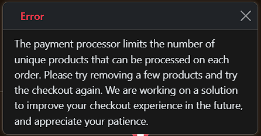

  </details>
---
# Credits

## Code

Two youtube videos were of grand relevance as guidance for coding:
* <a href="https://www.youtube.com/watch?v=sBjbty691eI&list=PLXuTq6OsqZjbCSfiLNb2f1FOs8viArjWy" target="_blank">Initial setup and general settings</a> 
* <a href="https://www.youtube.com/watch?v=WbNNESIxJnY&t=9796s" target="_blank">Saas specifics and more advanced development</a> 
* <a href="https://github.com/Code-Institute-Solutions/boutique_ado_v1" target="_blank">Code institute Boutique Ado ecomm project</a> - Used as guidance for essential core ecomm functionalities
* <a href="https://github.com/catapam/investnest" target="_blank"> InvestNest</a> - Re-usage of dashboard and account management functionalities (project of my own)

## Content

* ChatGPT and Claude AI: For text reviews, home page images, troubleshooting errors and copywriting assistance.

## Documentation

* <a href="https://github.com/kpetrauskas92/Mont-Adventures-PP5" target="_blank"> Mont Adventures</a> - Inspiration for README sessions and structure

---
# Acknowledgements

* My wife for the support and patience.
* Gareth Mc Girr: My mentor, for all the help and advice throughout the project.
* Code Institute: For all the training and guidance.
* WP Engine: My current employer, for providing all the support necessary and allowing great networking.